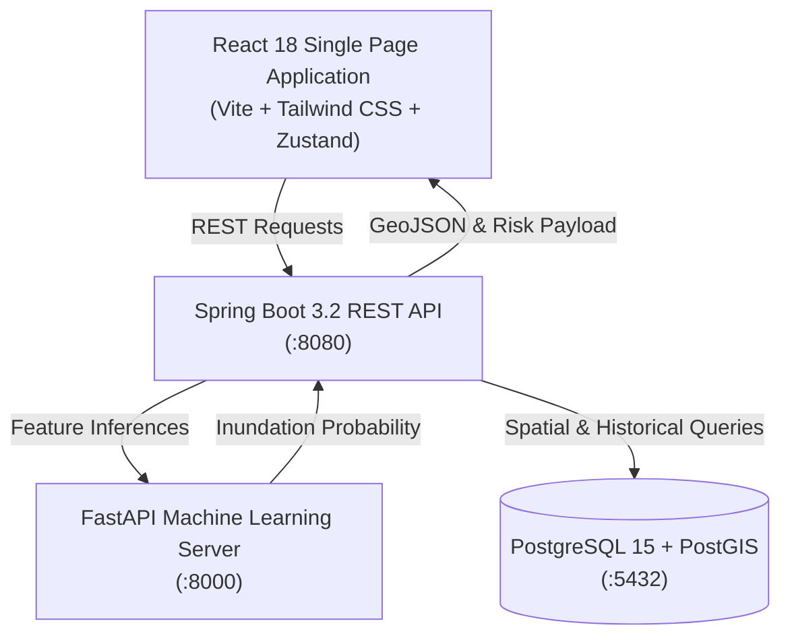

# 🌊 Chennai Flood Prediction System — Frontend Architecture & Implementation Plan

## Executive Summary
This document provides the complete architecture and roadmap for the modern React-based frontend of the **Chennai Urban Flood Prediction & Early Warning System**. It connects real-time telemetry from IMD meteorological stations, PostGIS spatial queries from the Spring Boot API, and inference payloads from an XGBoost machine learning model.

---

## 1. System Architecture Overview

---

## 2. Route & View Specifications

| Route | View Name | Primary Function |
| :--- | :--- | :--- |
| `/` | **Dashboard** | City-wide operational summary, active alert banners, 24h precipitation bar chart, and spatial risk distribution donut chart. |
| `/map` | **Live Flood Map** | Full-viewport interactive Leaflet map rendering Chennai's 15 administrative zones with real-time severity styling, hover highlights, and ward telemetry drawer. |
| `/predict` | **ML Simulator** | Parameterized simulation form matching the 12-feature XGBoost payload (hourly/cumulative rainfall, humidity, reservoir capacity) with instant risk classification and recommended emergency protocols. |
| `/history` | **Historical Archive** | Ground-truth benchmarking catalog documenting severe past inundations (2015 Historic Floods, 2021 Cyclone Nivar, 2023 Cyclone Michaung). |
| `/about` | **System Specifications** | Architectural documentation detailing data pipelines, feature engineering, and model validation metrics. |

---

## 3. Risk Classification Matrix

| Risk Tier | Color Code | Probability Range | Default Operational Action |
| :--- | :--- | :--- | :--- |
| **LOW** | `#10b981` (Emerald) | `< 35%` | Normal monitoring; routine stormwater clearance |
| **MODERATE** | `#f59e0b` (Amber) | `35% – 55%` | Waterlogging advisory; monitor low-lying ward catchments |
| **HIGH** | `#f97316` (Orange) | `55% – 75%` | Prepare flood barriers; divert arterial traffic from underpasses |
| **CRITICAL** | `#ef4444` (Rose) | `> 75%` | **Immediate Evacuation Protocol**; alert disaster management teams |

---

## 4. State Management & Data Polling

The client utilizes **Zustand** (`src/store/floodStore.js`) for lightweight centralized state synchronization:
- **Automatic Polling**: Configured with a 60-second reactive cycle to refresh zone GeoJSON polygons and precipitation telemetry.
- **Offline Resilience**: Built-in mock fallback data ensuring uninterrupted UI rendering even when local backend containers are stopped during design and development.

---

## 5. Development Roadmap & Milestones

- [x] **Phase 1: Foundation & Layout** — Vite configuration, Tailwind CSS integration, dynamic AppShell, and Header/Sidebar components.
- [x] **Phase 2: Spatial Layering** — Leaflet map integration with CartoDB Dark basemap tiles and GeoJSON zone rendering.
- [x] **Phase 3: Telemetry & Visualization** — Recharts bar charts for 24-hour precipitation and spatial distribution donut chart.
- [x] **Phase 4: ML Prediction Interface** — Interactive simulation form with live probability evaluation and response advisories.
- [x] **Phase 5: Historical Catalog** — Data tables for past storm events and system specification documentation.
